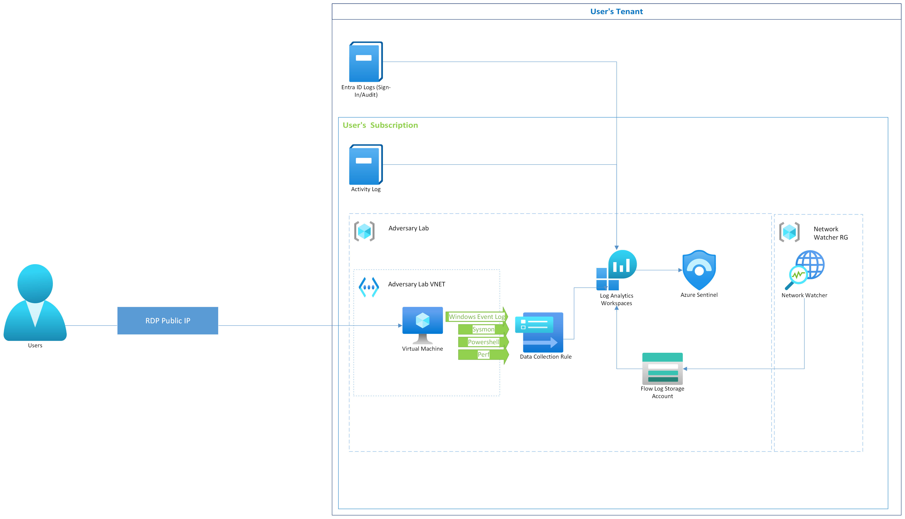

# Adversary Lab - Azure Security Monitoring Environment

A comprehensive Azure-based cybersecurity lab environment designed for security professionals to practice threat detection, incident response, emulating adversaries, and security monitoring using Microsoft Sentinel and Azure security services.

## Repository Structure

```
adversary-lab/
├── README.md                           # Main README file
├── adversary_lab_deploy.ps1            # Powershell script to deploy resources
├── main.bicep                          # Resource Group level infrastructure deployment
├── main_subscription.bicep             # Subscription level resources deployment
└── modules/                            # Bicep modules
    ├── networking.bicep                # Virtual network and security groups
    ├── vm_ama.bicep                    # Virtual machine with Azure Monitor Agent + 
    ├── log_analytics.bicep             # Log Analytics workspace
    ├── sentinel_deployment.bicep       # Microsoft Sentinel configuration
    └── vm_data_collection.bicep        # Data collection rules (includes Sysmon)
└── scripts/
    ├── Enable-PSLogging.ps1            # Enables PS Logging
    ├── Install-Stratus.ps1             # Installs Stratus Red Team
    └── Install-Sysmon.ps1              # Installs Sysmon Monitoring
└── cheatsheets/
    └── Azure_Log_Reference             # Reference for Entra and Activity Logs 
```

The Adversary Lab provides a complete security monitoring environment that includes:

- **Windows Virtual Machine** with Azure Monitor Agent (AMA) and Sysmon
- **Microsoft Sentinel** SIEM/SOAR platform
- **Log Analytics Workspace** for centralized logging
- **Data Collection Rules** for VM monitoring
- **Azure Activity Logs** Deployed for monitoring tenant management activity
- **Network Security Groups** with controlled access
- **Stratus Red Team** for cloud attack simulation and detection testing
- **Sysmon** for advanced Windows event logging

## Architecture

The lab deploys across three Azure scopes both manual and programatically:

1. **Resource Group Level**: Core infrastructure (VM, networking, Log Analytics, Sentinel)
2. **Subscription Level**: Azure Activity logs and security monitoring
3. **Tenant Level**: Entra ID audit and sign-in logs (manual configuration required)

<br>



<br>

## 📋 Prerequisites

### Required Software
- **PowerShell 7** - [Download here](https://learn.microsoft.com/en-us/powershell/scripting/install/installing-powershell-on-windows?view=powershell-7.5)
- **Azure PowerShell Module (Az)** - Install with: `Install-Module -Name Az`
- **VS code** - Install with `winget install code`

### Azure Requirements
- Azure subscription with **Contributor** permissions
- Ability to create resources at both **Resource Group** and **Subscription** levels
- Valid email address for notifications (optional)

### Network Requirements
- Public IP address for RDP access (auto-detected if not specified)
- Outbound internet connectivity for VM updates and monitoring

<br>

## 🚀 Quick Start 


### 1. Install Required Software
```powershell
#Install Powershell 7
PS C:\Users\<currentuser> winget install --id Microsoft.PowerShell --source winget

#From Powershell 7
PS C:\Users\<currentuser> winget install -e --id Microsoft.VisualStudioCode   
PS C:\Users\<currentuser> winget install Git.Git
PS C:\Users\<currentuser> winget install -e --id Microsoft.Bicep
PS C:\Users\<currentuser> Get-ExecutionPolicy -List
PS C:\Users\<currentuser> Set-ExecutionPolicy -ExecutionPolicy RemoteSigned -Scope CurrentUser
PS C:\Users\<currentuser> Install-Module -Name Az -Repository PSGallery -Force
```

### 2. Open VS Code Terminal Clone the Repo

```powershell
PS C:\Users\<currentuser> mkdir projects
PS C:\Users\<currentuser> cd projects
PS C:\Users\<currentuser> git clone https://github.com/purpleshellsecurity/adversary_lab.git
PS C:\Users\<currentuser> cd adversary_lab
```

<br>

> [!CAUTION]
> This lab creates real Azure resources that incur costs. Always ensure to monitor your budget to keep costs under control. When in doubt use the Azure Cost Calculator https://azure.microsoft.com/en-us/pricing/calculator/?msockid=2777256a672e6067007a30ef66326112

<br>

### 3. Basic Deployment
```powershell

#Ensure this is in a Powershell 7 Terminal
./adversary_lab_deploy.ps1
```
<br>

> [!IMPORTANT]  
> If you get an error "The file C:\adversary_lab_deploy.ps1 is not digitally signed. You cannot run this script on the current system. For more information about running scripts and setting execution policy, see about_Execution_Policies at https://go.microsoft.com/fwlink/?LinkID=135170." you can bypass it temporarily with the following command: powershell -ExecutionPolicy Bypass -File .\adversary_lab_deploy.ps1

<br>

## 📊 Deployed Components

### Core Infrastructure
- **Windows 11 Pro VM** with latest patches
- **Virtual Network** with security groups
- **Public IP** with RDP access restriction
- **Premium SSD** storage for performance

### Monitoring & Security
- **Log Analytics Workspace** with configurable retention
- **Microsoft Sentinel** with 12+ security solutions:
  - Windows Security Events
  - Azure Activity Logs
  - Microsoft Entra ID
  - Azure Storage
  - Network Security Groups
  - DNS Essentials
  - Azure & Windows Firewall
  - Azure Key Vault
  - And more...

### Data Collection
- **Azure Monitor Agent (AMA)** with advanced configuration
- **Data Collection Rules (DCR)** for:
  - Security Event Logs
  - Application & System Logs
  - PowerShell & Sysmon logs
  - Performance counters
  - Windows Defender logs

### Cost Management
- **Automatic VM shutdown** with email notifications
- **Budget alerts** at $50/month threshold
- **Resource tagging** for cost tracking

<br>

## 🔧 Post-Deployment Steps

### 1. Manual Entra ID Configuration
Due to elevated permissions required, configure Entra ID logs manually:

1. Navigate to **Azure Portal** → **Microsoft Entra ID** → **Diagnostic settings**
2. Click **Add diagnostic setting**
3. Configure:
   - **Name**: `EntraID-AuditLogs`
   - **Logs**: Check `AuditLogs` and `SignInLogs` `MicrosoftGraphActivityLogs` as starters (Link to Azure_Log_Reference and Azure Monitor Reference below)
   - **Destination**: Send to Log Analytics workspace
   - **Workspace**: Select your deployed workspace

[Microsoft Graph Activity Logs](https://learn.microsoft.com/en-us/azure/azure-monitor/reference/tables/microsoftgraphactivitylogs)
[Azure Log Reference](/cheatsheets/Azure_Log_Reference.md)


### 2. Enable Flow Logs - Azure Portal

``` bash
   A storage account has been created and is ready for VNET flow logs:
   1. Navigate to Azure Portal > Network Watcher > Flow logs
   2. Create a new VNET flow log with the following configuration:
       - Target: Your Virtual Network" "Gray"
       - Storage Account: $StorageAccountName"
       - Log Analytics: $WorkspaceName (optional for Traffic Analytics)"
       - Format: JSON Version 2" "
 ```

### 2. Connect to VM
Use the provided RDP command:
```bash
mstsc /v:<VM_PUBLIC_IP>
```

### 3. Install Sysmon, Advanced Powershell Logging, and Stratus Red Team

<br>

```powershell
# Install Sysmon
./Install-Sysmon.ps1
```
<br>

```powershell
# Install Advanced PS Logging
./Enable-PSLogging.ps1
```
<br>

```powershell
# Deploy Stratus Red Team
./Install-Stratus.ps1
```
<br>

### 4. Verify Data Collection
Wait 10-15 minutes, then check:
- Check the Log Analytics Workspace has data within the AzureActivity, Event Tables, Flow Logs, and more. Sample KQL provided below.

<br>

> [!IMPORTANT]  
> Azure Activity Logs can be provisioned instantly or take up to an an hour to initial provision. It is dependent on the load of the service at the time of the request. 

<br>

### KQL Query Examples
Monitor activities with these sample queries:

```kql
// Recent Azure Activity (Management) Events
AzureActivity
| where TimeGenerated > ago(2h)
| project TimeGenerated, OperationName, OperationNameValue

// PowerShell Logs
Event
| where Source == "Microsoft-Windows-PowerShell"
| where TimeGenerated > ago(24h)

// Sysmon Logs
Event
| where Source == "Microsoft-Windows-Sysmon"
| where TimeGenerated > ago(24h)


// Verify Flow logs
NTANetAnalytics
| where TimeGenerated > ago (6h)

```
<br>

### Attack Simulation Scenarios
The lab supports various security testing scenarios:

1. **Credential Attacks**: Test password spraying, brute force
2. **Privilege Escalation**: Simulate local privilege escalation
3. **Lateral Movement**: Network discovery and movement simulation
4. **Data Exfiltration**: File transfer and data staging
5. **Persistence**: Registry modifications, scheduled tasks
<br>

## Troubleshooting

### Common Issues

**Permission Errors**
- Ensure you have Contributor role on the subscription
- Try refreshing Azure credentials: `Connect-AzAccount -Force`
- Check if you can create resources in the specified region

**Deployment Failures**
- Verify all Bicep files are present and not corrupted
- Check Azure service availability in your region
- Ensure VM size is available in the selected location

**Network Connectivity**
- Verify your public IP is correctly detected
- Check NSG rules allow RDP from your IP
- Confirm VM has started successfully

**Data Collection Issues**
- Wait 15-30 minutes for initial data flow
- Verify Azure Monitor Agent is installed and running
- Check Data Collection Rule associations


<br>

## Cost Optimization

### Automatic Cost Controls
- **VM Auto-shutdown**: Default 11:30 PM daily
- **Budget Alerts**: $50/month with email notifications
- **Premium Storage**: Balanced performance and cost

### Manual Cost Savings
- Stop VM when not in use
- Reduce Log Analytics retention if not needed
- Adjust logging being sent to Log Analytics/Sentinel where possible. 

### Cost Estimation
<br>

> [!CAUTION]
> These are estimates and its best to use the Azure Cost Calculator for accurate up to date pricing. https://azure.microsoft.com/en-us/pricing/calculator/?msockid=2777256a672e6067007a30ef66326112

<br>

Typical monthly costs (East US region):
- **Standard_D2s_v3 VM**: ~$70/month (if running 24/7)
- **With auto-shutdown**: ~$30-40/month
- **Log Analytics**: ~$5-15/month (depending on data volume)
- **Total estimated**: ~$35-55/month with auto-shutdown

<br>

## Security Considerations

### Network Security
- RDP access restricted to your public IP only
- NSG rules follow principle of least privilege
- No public access to Log Analytics workspace

### VM Security
- Windows 11 with latest security updates
- Azure Monitor Agent for comprehensive logging
- Boot diagnostics enabled for troubleshooting

### Data Protection
- All logs encrypted at rest and in transit
- Configurable retention periods
- Azure RBAC for access control

<br>

## Resource Cleanup 
- All the lab resoruces are contained in resource group that can be easily deleted via the portal. 

## Contributing

Contributions welcome! Areas for enhancement:
- Additional security solutions
- Custom detection rules
- Attack simulation scripts
- Documentation improvements
- Cost optimization features

<br>

## Additional Resources

- [Microsoft Sentinel Documentation](https://docs.microsoft.com/en-us/azure/sentinel/)
- [Azure Monitor Agent Overview](https://docs.microsoft.com/en-us/azure/azure-monitor/agents/azure-monitor-agent-overview)
- [KQL Query Language Reference](https://docs.microsoft.com/en-us/azure/data-explorer/kql-quick-reference)
- [Windows Security Events Reference](https://docs.microsoft.com/en-us/windows/security/threat-protection/auditing/security-auditing-overview)
<br>

## License

This project is provided as-is for educational and testing purposes. Do not deploy this within any tenant other than your own without prior authorization and written consent. 
---

