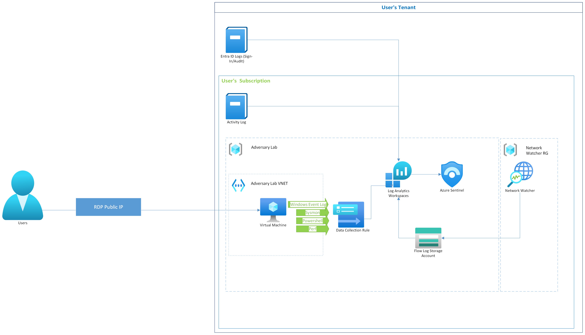

# Adversary Lab - Azure Security Monitoring Environment

A comprehensive Azure-based cybersecurity lab environment designed for security professionals to practice threat detection, incident response, adversary emulation, and security monitoring using Microsoft Sentinel and Azure security services.

## Overview

The Adversary Lab provides a complete security monitoring environment that includes:

- **Windows 11 Pro VM** with Azure Monitor Agent (AMA)
- **Microsoft Sentinel** SIEM/SOAR platform with 12+ security solutions
- **Log Analytics Workspace** for centralized logging
- **Data Collection Rules** for comprehensive VM monitoring
- **VNet Flow Logs** with Traffic Analytics for network visibility
- **Azure Activity Logs** for tenant management monitoring
- **Network Security Groups** with controlled access
- **Blue Team Tools** - Sysmon, PowerShell logging, Windows audit policies
- **Red Team Tools** - Azure/Entra ID security assessment tooling (optional)

## Repository Structure

```
adversary-lab/
├── README.md                              # Documentation
├── CONTRIBUTING.md                        # Architecture and contributor guide
├── adversary_lab_deploy.ps1               # Main deployment script
├── main.bicep                             # Resource Group deployment orchestration
├── main_subscription.bicep                # Subscription-level resources
│
├── modules/                               # Bicep modules (layered architecture)
│   ├── networking.bicep                   # Virtual network, NSG, public IP
│   ├── storage.bicep                      # Storage account for flow logs
│   ├── log_analytics.bicep                # Log Analytics workspace
│   ├── vm.bicep                           # Windows VM with auto-shutdown
│   ├── sentinel.bicep                     # Microsoft Sentinel + solutions
│   ├── vm_monitoring.bicep                # AMA extension + Data Collection Rules
│   ├── network_monitoring.bicep           # VNet flow logs (subscription scope)
│   └── network_monitoring_flowlog.bicep   # Flow log resource (nested module)
│
├── scripts/                               # Post-deployment scripts
│   ├── Install-BlueTeamTools.ps1          # Sysmon, PS logging, audit policies
│   ├── Install-RedTeamTools.ps1           # Offensive security tools
│   ├── Uninstall-BlueTeamTools.ps1        # Remove defensive tools
│   └── Uninstall-RedTeamTools.ps1         # Remove offensive tools
│
└── cheatsheets/
    └── Azure_Log_Reference.md             # Reference for Entra and Activity Logs
```

## Architecture



The lab deploys across two Azure scopes:

| Scope | Resources | Deployment |
|-------|-----------|------------|
| **Resource Group** | VM, networking, Log Analytics, Sentinel, storage | Automated |
| **Subscription** | Azure Activity logs, VM role assignments, VNet flow logs | Automated |

<br>

> [!TIP]
>  **Contributors:** See [CONTRIBUTING.md](CONTRIBUTING.md) for module architecture and dependency layers.

<br>

## Prerequisites

### Required Software

| Software | Installation |
|----------|--------------|
| PowerShell 7 | `winget install --id Microsoft.PowerShell --source winget` |
| Azure PowerShell (Az) | `Install-Module -Name Az -Repository PSGallery -Force` |
| VS Code | `winget install -e --id Microsoft.VisualStudioCode` |
| Git | `winget install Git.Git` |
| Bicep CLI | `winget install -e --id Microsoft.Bicep` |

### Azure Requirements

- Azure subscription with **Contributor** permissions
- Ability to create resources at both **Resource Group** and **Subscription** levels
- Valid email address for notifications (optional)

### Network Requirements

- Public IP address for RDP access (auto-detected if not specified)
- Outbound internet connectivity for VM updates and monitoring

## Quick Start

### 1. Clone the Repository

```powershell
mkdir ~/projects
cd ~/projects
git clone https://github.com/purpleshellsecurity/adversary_lab.git
cd adversary_lab
```

### 2. Deploy the Lab

```powershell
# Run from PowerShell 7 terminal
./adversary_lab_deploy.ps1
```

The interactive deployment will prompt for:
- Resource Group name and Azure region
- Subscription ID
- VM administrator credentials (or auto-generate password)
- Your public IP for RDP access (auto-detected)
- Email for notifications (optional)

<br>


> [!NOTE]
> If you encounter an execution policy error, run:
> ```powershell
> powershell -ExecutionPolicy Bypass -File .\adversary_lab_deploy.ps1
> ```

<br>


> [!WARNING]
> This lab creates real Azure resources that incur costs. Monitor your spending and use the [Azure Pricing Calculator](https://azure.microsoft.com/en-us/pricing/calculator/) for estimates.

<br>

## Deployed Components

### Core Infrastructure

| Component | Description |
|-----------|-------------|
| Windows 11 Pro VM | Latest patches, Premium SSD, system-assigned managed identity |
| Virtual Network | 10.0.0.0/16 address space with security groups |
| Public IP | Static IP with RDP access restricted to your IP |
| Storage Account | Encrypted storage for VNet flow logs |

### Monitoring & Security

| Component | Description |
|-----------|-------------|
| Log Analytics Workspace | Centralized logging with configurable retention |
| Microsoft Sentinel | SIEM/SOAR with 12 security solutions pre-installed |
| Azure Monitor Agent | Advanced VM telemetry collection |
| Data Collection Rules | Security, PowerShell, Sysmon, Defender, and performance logs |
| VNet Flow Logs | Network traffic analysis with Traffic Analytics |

### Sentinel Solutions (Pre-installed)

- Windows Security Events
- Azure Activity
- Microsoft Entra ID
- Azure Storage
- Azure Network Security Groups
- Azure Resource Graph
- Azure Security Benchmark
- Azure Logic Apps
- Azure Key Vault
- DNS Essentials
- Azure Firewall
- Windows Firewall

### Cost Management

| Feature | Default |
|---------|---------|
| Auto-shutdown | 11:30 PM daily (configurable) |
| Budget alerts | $50/month threshold (requires email) |
| Resource tagging | Environment, Project, Purpose tags |

## Post-Deployment Steps

### 1. Configure Entra ID Logs (Manual)

Due to elevated permissions required, configure Entra ID diagnostic logs manually:

1. Navigate to **Azure Portal** → **Microsoft Entra ID** → **Diagnostic settings**
2. Click **Add diagnostic setting**
3. Configure:
   - **Name**: `EntraID-AuditLogs`
   - **Logs**: Select `AuditLogs`, `SignInLogs`, `MicrosoftGraphActivityLogs`
   - **Destination**: Send to Log Analytics workspace
   - **Workspace**: Select your deployed workspace

**References**:
- [Microsoft Graph Activity Logs](https://learn.microsoft.com/en-us/azure/azure-monitor/reference/tables/microsoftgraphactivitylogs)
- [Azure Log Reference](/cheatsheets/Azure_Log_Reference.md)

### 2. Connect to VM

Use the RDP command from the deployment output:

```bash
mstsc /v:<VM_PUBLIC_IP>
```

Credentials are saved to `credentials.txt` in the deployment directory.

### 3. Install Security Tools

Run these scripts on the VM after connecting:

| Script | What It Installs |
|--------|------------------|
| Install-BlueTeamTools | Sysmon (SwiftOnSecurity config), PowerShell script block & module logging, transcription, Windows audit policies |
| Install-RedTeamTools | AADInternals, Az, Microsoft.Graph, GraphRunner, TokenTacticsV2, AzureHound, ROADtools, MicroBurst, PowerZure, ScoutSuite, o365spray |

<br>
> [!TIP]
> Run `Get-Help .\scripts\Install-RedTeamTools.ps1 -Full` for complete details and parameters.

<br>

**Blue Team (Defensive Monitoring):**
```powershell
# Install Sysmon, PowerShell logging, and Windows audit policies
.\scripts\Install-BlueTeamTools.ps1

# Or install specific components
.\scripts\Install-BlueTeamTools.ps1 -Sysmon
.\scripts\Install-BlueTeamTools.ps1 -PSLogging
.\scripts\Install-BlueTeamTools.ps1 -AuditPolicies
```

**Red Team (Offensive Tools):**
```powershell
# Install Azure red team and security assessment tools
.\scripts\Install-RedTeamTools.ps1

# Skip specific components if needed
.\scripts\Install-RedTeamTools.ps1 -SkipChocolatey
.\scripts\Install-RedTeamTools.ps1 -SkipPython
```

**Uninstall (if needed):**
```powershell
.\scripts\Uninstall-BlueTeamTools.ps1
.\scripts\Uninstall-RedTeamTools.ps1
```

### 4. Verify Data Collection

Wait 10-15 minutes for initial data flow, then validate with these KQL queries:

```kql
// Azure Activity (Management) Events
AzureActivity
| where TimeGenerated > ago(2h)
| project TimeGenerated, OperationName, OperationNameValue
| take 10

// PowerShell Logs
Event
| where Source == "Microsoft-Windows-PowerShell"
| where TimeGenerated > ago(24h)
| take 10

// Sysmon Events
Event
| where Source == "Microsoft-Windows-Sysmon"
| where TimeGenerated > ago(24h)
| take 10

// VNet Flow Logs (Traffic Analytics)
NTANetAnalytics
| where TimeGenerated > ago(6h)
| take 10
```
<br>

> [!NOTE]
> Azure Activity Logs can take up to an hour to provision depending on service load.

<br>

## Attack Simulation Scenarios

The lab supports various security testing scenarios:

| Scenario | Description |
|----------|-------------|
| Credential Attacks | Password spraying, brute force detection |
| Privilege Escalation | Local privilege escalation simulation |
| Lateral Movement | Network discovery and movement patterns |
| Data Exfiltration | File transfer and data staging detection |
| Persistence | Registry modifications, scheduled tasks |

## Troubleshooting

### Permission Errors

- Ensure you have **Contributor** role on the subscription
- Refresh credentials: `Connect-AzAccount -Force`
- Verify region availability for your VM size

### Deployment Failures

- Verify all Bicep files are present in `modules/` directory
- Check Azure service availability in your region
- Review deployment output for specific error messages

### Network Connectivity

- Verify your public IP was correctly detected
- Check NSG rules allow RDP (port 3389) from your IP
- Confirm VM has started successfully in the portal

### Data Collection Issues

- Wait 15-30 minutes for initial data ingestion
- Verify Azure Monitor Agent status: `Get-AzVMExtension -VMName <name> -ResourceGroupName <rg>`
- Check Data Collection Rule associations in the portal

## Cost Optimization

### Automatic Controls

| Feature | Default | How to Customize |
|---------|---------|------------------|
| VM auto-shutdown | 11:30 PM EST daily | Pass `-ShutdownTime` and `-ShutdownTimeZone` parameters |
| Budget alerts | $50/month threshold | Requires email during setup |
| Resource tagging | Environment, Project, Purpose | Edit `main.bicep` |

**Customizing Auto-Shutdown:**

```powershell
# Example: Set shutdown to 7:00 PM Pacific Time
./adversary_lab_deploy.ps1 -ShutdownTime "1900" -ShutdownTimeZone "Pacific Standard Time"
```

Available parameters:
- `-ShutdownTime`: 24-hour format (e.g., `"1900"` for 7:00 PM, `"2330"` for 11:30 PM)
- `-ShutdownTimeZone`: Windows timezone name (e.g., `"Eastern Standard Time"`, `"UTC"`)
- `-EnableAutoShutdown`: Set to `$false` to disable auto-shutdown entirely

<br>

> [!NOTE]
> If you want a specific timezone you can look it up with this PS command. Ensure to use StandardName when configuring the timezone.
> ```powershell
> Get-Timezone -Name "*astern*" | Format-Table Id, DisplayName, StandardName
> ```

<br>

### Manual Savings

- Stop VM when not in use
- Reduce Log Analytics retention if historical data isn't needed
- Review and tune Data Collection Rules to reduce log volume

### Estimated Monthly Costs (East US)

| Resource | 24/7 Running | With Auto-shutdown |
|----------|--------------|-------------------|
| Standard_D2s_v4 VM | ~$85/month | ~$35-45/month |
| Log Analytics | ~$5-15/month | ~$5-15/month |
| Storage (flow logs) | ~$1-5/month | ~$1-5/month |
| **Total** | **~$90-105/month** | **~$40-65/month** |

<br>

> [!TIP]
> Use the [Azure Pricing Calculator](https://azure.microsoft.com/en-us/pricing/calculator/) for accurate estimates.

## Security Considerations

### Network Security

- RDP access restricted to your public IP only
- NSG rules follow principle of least privilege
- No public access to Log Analytics workspace

### VM Security

- Windows 11 with automatic security updates
- System-assigned managed identity for Azure operations
- Azure Monitor Agent for comprehensive logging
- Boot diagnostics enabled

### Data Protection

- All logs encrypted at rest and in transit
- Configurable retention periods
- Azure RBAC for access control

## Cleanup

All lab resources are contained in a single resource group. To remove everything:

1. Navigate to **Azure Portal** → **Resource Groups**
2. Select your lab resource group
3. Click **Delete resource group**

<br>

> [!NOTE]
> The `NetworkWatcherRG` resource group (containing the flow log) may need to be cleaned up separately if you no longer need Network Watcher in that region.

<br>
<br>


## Contributing

Contributions welcome! See [CONTRIBUTING.md](CONTRIBUTING.md) for architecture details and guidelines.

Areas for enhancement:
- Additional Sentinel detection rules
- Custom attack simulation scripts
- Additional security solutions
- Documentation improvements
- Cost optimization features

## Additional Resources

- [Microsoft Sentinel Documentation](https://docs.microsoft.com/en-us/azure/sentinel/)
- [Azure Monitor Agent Overview](https://docs.microsoft.com/en-us/azure/azure-monitor/agents/azure-monitor-agent-overview)
- [KQL Quick Reference](https://docs.microsoft.com/en-us/azure/data-explorer/kql-quick-reference)
- [Windows Security Events Reference](https://docs.microsoft.com/en-us/windows/security/threat-protection/auditing/security-auditing-overview)

<br>

>[!NOTE]
> **Ready to start building detections?** Join ([Adversary Lab](https://www.skool.com/adversary-lab-community/about))

<br>

## License

This project is licensed under the [MIT License](LICENSE).

> ⚠️ **Disclaimer:** This project is provided as-is for educational and testing purposes. Do not deploy within any tenant other than your own without prior authorization and written consent.